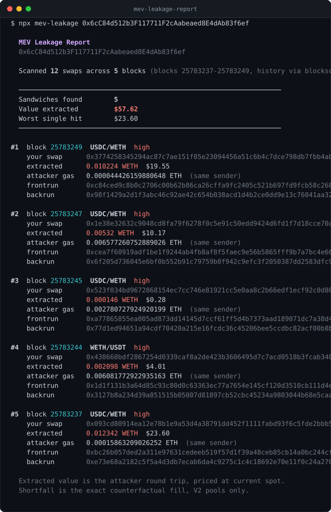

<div align="center">

# 🥪 MEV Leakage Report

**Find out how much value MEV bots have quietly extracted from your wallet.**

[](https://www.typescriptlang.org/)
[](https://nodejs.org/)
[](#development)
[](#quick-start)
[](LICENSE)

</div>

---

MEV research is published in aggregate — billions extracted, thousands of searchers, charts by the month. None of it tells you what happened to **you**.

This does. Point it at an address and it scans that address's real swap history, rebuilds every block it traded in, finds where a bot bracketed a trade, and totals up what was taken.

<p align="center">
  
</p>

<sub>Real output from an actual mainnet run, not a mockup.</sub>

<details>
<summary>Same output as text</summary>

```
  MEV Leakage Report
  0x6cC84d512b3F117711F2cAabeaed8E4dAb83f6ef

  Scanned 12 swaps across 5 blocks (blocks 25783237-25783249, history via blockscout)

  ──────────────────────────────────────────────────────────────────
  Sandwiches found        5
  Value extracted         $57.62
  Worst single hit        $23.60
  ──────────────────────────────────────────────────────────────────

#1  block 25783249  USDC/WETH  high
    your swap      0x3774258345294ac87c7ae151f05e23094456a51c6b4c7dce798db7fbb4ab4320
    extracted      0.010224 WETH  $19.55
    attacker gas   0.000044426159880648 ETH  (same sender)
    frontrun       0xc84ced9c8b0c2706c00b62b86ca26cffa9fc2405c521b697fd9fcb58c268f584
    backrun        0x98f1429a2d1f3abc46c92ae42c654b038acd1d4b2ce0dd9e13c76041aa32df0b

#2  block 25783247  USDC/WETH  high
    your swap      0x1e38e32632c9048cd8fa79f6278f0c5e91c50edd9424d6fd1f7d18cce70aaf28
    extracted      0.00532 WETH  $10.17
    attacker gas   0.006577260752889026 ETH  (same sender)
    frontrun       0xcea7f60919adf1be1f9244ab4fb8af8f5faec9e56b5865fff9b7a7bc4e665f81
    backrun        0x6f205d736045e6bf0b552b91c79759b0f942c9efc3f2050387dd2583dfc94135
```

</details>

## Quick start

No API keys, no signup, no `.env` file:

```bash
npm install
```

```bash
npm run dev -- 0x6cc84d512b3f117711f2caabeaed8e4dab83f6ef
```

It falls back to a public mainnet RPC and reads transaction history from [Blockscout](https://eth.blockscout.com), which is keyless.

For longer scans, copy `.env.example` to `.env` and point `RPC_URL` at a dedicated endpoint so you aren't rate limited. `ETHERSCAN_API_KEY` is optional and only changes where the transaction list comes from.

## Usage

```bash
mev-leakage <address> [options]
```

| Flag | Default | Meaning |
| :--- | :--- | :--- |
| `--limit <n>` | `200` | How many recent transactions to scan |
| `--min-confidence <0-1>` | `0.5` | Drop matches scoring below this |
| `--from-block <n>` | — | Only scan from this block onward |
| `--include-unprofitable` | off | Keep brackets whose round trip lost money |
| `--json` | off | Machine-readable output on stdout |
| `--help` | — | Show usage |

Progress goes to stderr and the report to stdout, so `--json` pipes cleanly:

```bash
npm run dev -- 0xYourAddress --json > leakage.json
```

## How it works

A sandwich is three trades on one pool in one block: a bot buys ahead of you, you fill at the worsened price, the bot sells behind you.

```
   ┌──────────┐     ┌──────────┐     ┌──────────┐
   │ frontrun │ ──► │   you    │ ──► │ backrun  │
   │  bot buys│     │   fill   │     │ bot sells│
   └──────────┘     └──────────┘     └──────────┘
     price up      worse price        price back
                                      bot pockets
                                     the difference
```

1. **Find your trades.** Pull the transactions the address sent, take their receipts, decode every `Swap` event. Uniswap V2 and V3 encode swaps differently — V2 with four unsigned amounts, V3 with two signed — so both normalise to a single in/out shape.
2. **Rebuild the block.** For each pool the address traded on, fetch that pool's full log set for that one block. Filtering by pool address keeps this cheap enough for a free RPC tier.
3. **Look for the bracket.** A frontrun trades before you in your direction; a backrun trades after you in the opposite direction, unwinding roughly the position the frontrun opened.
4. **Prove the two legs belong together.** See below — this decides whether the tool tells the truth.
5. **Quantify.** Two numbers, described below.

### Proving the attacker is one actor

The obvious approach is to check whether the frontrun and backrun share an address in their `Swap` events. That approach is wrong, and quietly so.

On a Uniswap V2 pair, the `Swap` event's `sender` is `msg.sender` of `pair.swap()` — which for ordinary retail flow is the **router contract**, identical across completely unrelated users. Matching on it links strangers. And since it gates whether a candidate is admitted at all, it manufactures sandwiches out of ordinary market activity.

So a shared address only counts as evidence when the victim did not also use it. Where the overlap is nothing but the shared router, the transactions themselves must corroborate it: the same `tx.from`, or the same target contract. That second case is real and common — bots rotate funding EOAs through one shared execution contract, so requiring identical senders alone would miss them.

### The two numbers

> **Extracted** — what the attacker took out of the block.
> **Shortfall** — what your fill actually cost you.

**Extracted** is the attacker's round trip: what they spent opening the position versus what they recovered closing it, denominated in the token you were selling.

A backrun rarely sells back *exactly* what the frontrun bought. Ignoring the remainder makes a profitable partial unwind look like a large loss — during development this produced sandwiches reporting **−3,587 USDC** that were in fact profitable, because the bot had kept 1.87 WETH unsold. So leftover inventory is valued at the price the backrun itself executed at, keeping the figure in one token.

**Shortfall** is the counterfactual: what you would have received against the pool as it stood *before* the frontrun, minus what you actually received.

Computing that needs the reserves before the frontrun, which normally means an archive node. **It doesn't here.** V2 emits a `Sync` event carrying post-trade reserves inside every swap call, just ahead of the `Swap` — so the frontrun can be run backwards against its own snapshot:

```
reserveIn_before  = reserveIn_after  − frontrunAmountIn
reserveOut_before = reserveOut_after + frontrunAmountOut
```

From there the constant-product formula with the 0.3% fee gives the clean fill exactly, in integer math that matches on-chain rounding. That single trick is what lets the whole tool run on a free RPC tier.

## Limitations

Stated plainly, because a detector that overclaims is worse than none.

- **V3 shortfall is not computed.** Concentrated liquidity can't be reconstructed from events alone — you'd need the tick map. V3 sandwiches are still detected and their extracted value is still exact; only the counterfactual column is blank.
- **USD figures use current spot prices**, not prices at the time of the trade. Token amounts are always exact; the dollar column drifts for tokens that have moved a lot since.
- **Same-block bracketing only.** Multi-block MEV and cross-pool routing attacks are out of scope.
- **Confidence is a heuristic.** High means the actor link, the transaction-level corroboration, and the unwind ratio all agree. It is not proof of intent.
- **Unprofitable brackets are hidden by default.** A bracket that lost money was probably coincidence. `--include-unprofitable` shows them.
- **A 0.3% fee is assumed** for V2 pools. Forks running custom fees will show a slightly off shortfall.
- **CoinGecko's free tier serves one token per request** and throttles hard, so pricing is serialised and cached. Reports touching many tokens take a few seconds longer.

## Development

```bash
npm test
```

13 tests. The core suite replays a sandwich through real constant-product math and asserts the detector recovers the exact numbers that went in. The rest cover the failure modes that actually bit during development:

- router-only links rejected, shared-target links accepted
- partial unwinds not misread as losses
- an already-unwound frontrun not reused against a later victim
- V3 logs with same-sign amounts refused
- shortfall invariant to the order logs arrive in

```bash
npm run typecheck   # strict, with noUncheckedIndexedAccess
npm run build
```

### Layout

| File | Role |
| :--- | :--- |
| `src/sandwich.ts` | Detection, actor linking, profit and shortfall math |
| `src/swaps.ts` | V2/V3 log decoding, normalised to one shape |
| `src/pools.ts` | Pool and token metadata via Multicall3 |
| `src/history.ts` | Transaction history, Etherscan or keyless Blockscout |
| `src/pricing.ts` | USD resolution, cached and rate-limit aware |
| `src/report.ts` | Terminal rendering and JSON output |

## License

MIT
